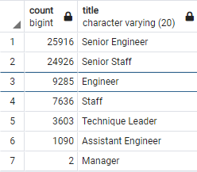
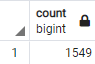
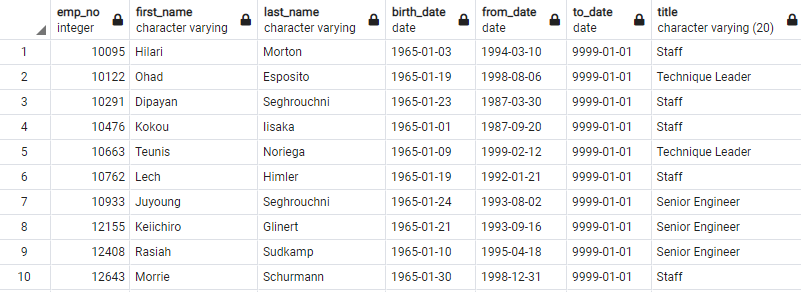

# RBCModule7-Challenge

## Overview of Analysis
The purpose of this project is to exemplify basic SQL database setup and functions. Our context is that our manager has given us a task to determine the number of retiring employees per title and identify those employees who are elgible for entry into a mentorship program. This is in anticipation of a so-called, "silver tsunami" of retiring employees. 
## Results
Here we list four major results from the project deliverables:
- First, as expected, most of the retiring employees are in senior positions as seen in this image: 

- Second, the number of retiring employees is a significant portion of the employee populace since we only have ~440,000 entries in the database. 

- Next, the number of available employees that could take part in the mentorship program is extremely limited as seen here 

- Lastly, it appears that most of these potential mentors were hired in the 1990's so are well experienced. See this sample from the results here:

## Summary
In summary, we must sound the alarm about this upcoming "silver tsunami" 70,000+ employees on the road to retirement. With two-thirds in senior positions there are many roles that will need to be filled and only 1,549 employees ready to enroll in the mentorship program, there aren't enough employees ready to mentor the next generation.

Further suggested queries for additional analysis would be a breakdown of eligible mentors by their titles just as we did for the retirement count as well as counts of the total number of employees and breakdowns by time-employeed so as to consider other potential employees for the mentorship program.